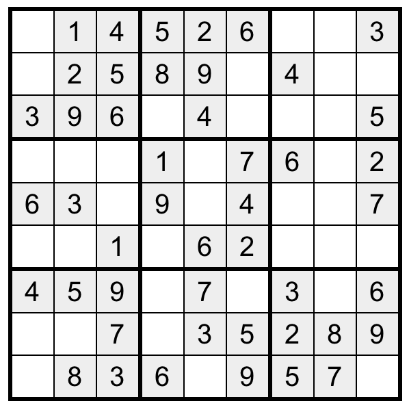
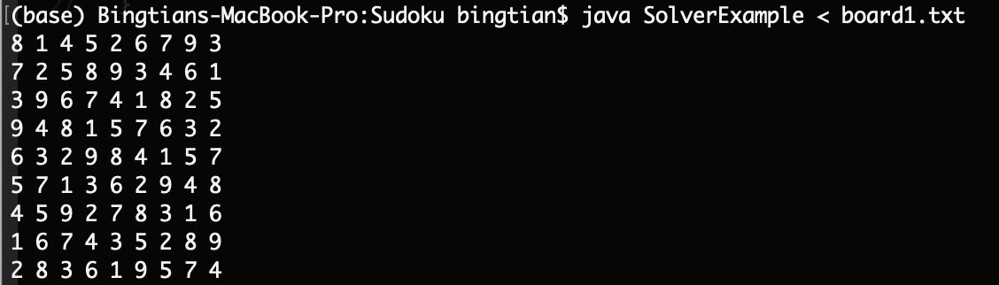
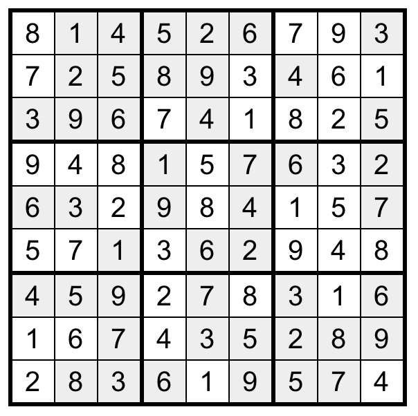
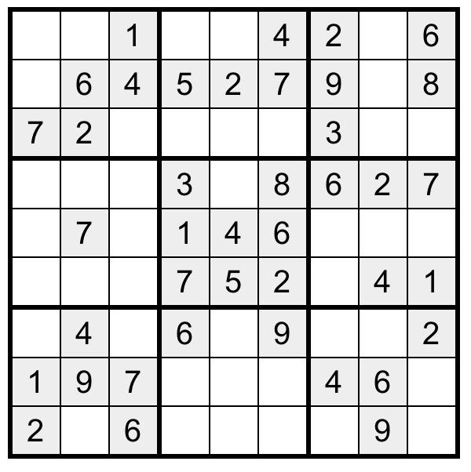
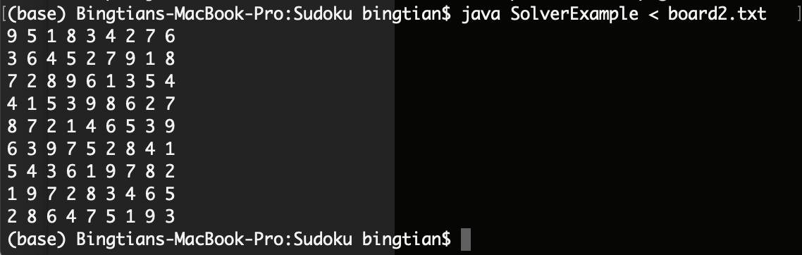
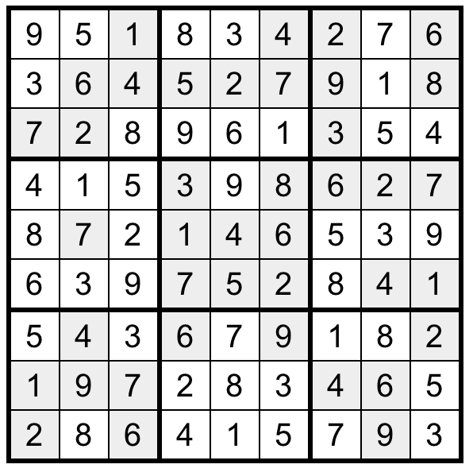

# A simple 9x9 Sudoku board solver
Given a nxn sudoku board, we can use backtrack/depth first search to recursively search for
all possible solution. Here I used 9x9 as an example for convenience, as the algorithm runtime
grow exponentially with larger board.

## Algorithm

Solve(board)

For each empty space (i,j) on the board:
  - Try to place number 1...9 on the (i,j) position.
      - If placing that number causes a invalid board, we move to the next number/solution.
      - Else we go solve the board recursively by invoking solve() with new pieces inserted.
  - If we try all possible solution recursively and none gives valid board, backtrack to previous
  number we try to fill in.

We find the solution if we manage to fill every empty space on the board and reach here.

Validate(board)

To validate whether a number is legal in current board:
  - check the 3x3 sub-boxes if there's a same number
  - check the column if there's a same number
  - check the row if there's a same number

## Examples

I grab a couple randomly generated sudoku board online and try it with the algorithm.

The site used to generate sudoku board and the solution. [Here!](https://www.sudokuweb.org/) 

#### Sample1

This is a sample unsolved board.

This is the result return by the code.

The solution given by online site.

#### Sample2

This is a sample unsolved board.

This is the result return by the code.

The solution given by online site.

## Analysis

### Time Complexity
Since each empty space has up to 9 solutions and there are O(n) empty spaces in the worst cases. 
Time complexity is O(9^n).

### Space Complexity
The algorithm place the potential solutions in-place, at first glance it would be O(1).
However we also uses the stack spaces when doing recursion/backtracking, the space
complexity is still O(9^n).

### Optimization
We could use contraint solving to further improve our runtime and space usage. Instead of trying
all 9 possible numbers when we encounter a empty space, we can prune away some candidate numbers by looking at
its corresponding 3x3 sub-box, its current row and its current column. Hence practically we could prune away
some recursion branches when running the algorithm, however the space/time complexity remain unchanged in
the worst case analysis.
